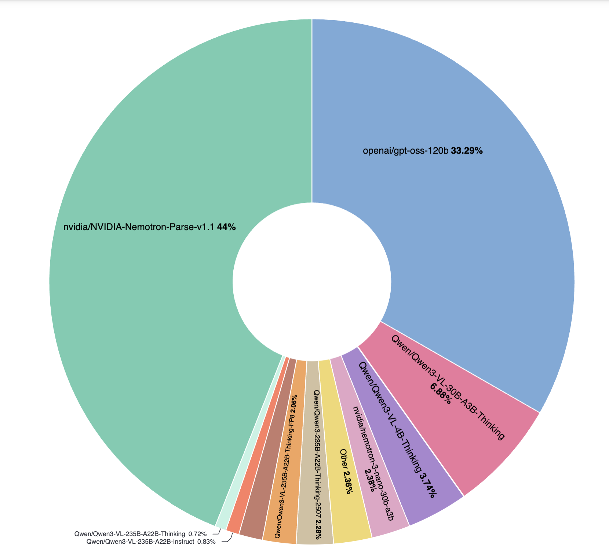

# 🎨 NeMo Data Designer

[](https://github.com/NVIDIA-NeMo/DataDesigner/actions/workflows/ci.yml)
[](https://opensource.org/licenses/Apache-2.0)
[](https://www.python.org/downloads/) [](https://docs.nvidia.com/nemo/microservices/latest/index.html) [](https://nvidia-nemo.github.io/DataDesigner/) 

**Generate high-quality synthetic datasets from scratch or using your own seed data.**

---

## Welcome!

Data Designer helps you create synthetic datasets that go beyond simple LLM prompting. Whether you need diverse statistical distributions, meaningful correlations between fields, or validated high-quality outputs, Data Designer provides a flexible framework for building production-grade synthetic data.

## What can you do with Data Designer?

- **Generate diverse data** using statistical samplers, LLMs, or existing seed datasets
- **Control relationships** between fields with dependency-aware generation
- **Validate quality** with built-in Python, SQL, and custom local and remote validators
- **Score outputs** using LLM-as-a-judge for quality assessment
- **Iterate quickly** with preview mode before full-scale generation

---

### 📣 Heads-up: async engine is now the default

Data Designer now runs pipelines on a cell-level async engine that overlaps independent columns and adapts concurrency per (provider, model). On most pipelines this is faster with no config changes; on slow self-hosted endpoints, set `inference_parameters.timeout` to your real per-request latency. See [Architecture & Performance → Async Engine](https://nvidia-nemo.github.io/DataDesigner/latest/concepts/architecture-and-performance/#async-engine) for the behaviors worth knowing about.

If you hit anything unexpected, fall back to the legacy sync engine for one transitional release with `DATA_DESIGNER_ASYNC_ENGINE=0`, and please [open an issue](https://github.com/NVIDIA-NeMo/DataDesigner/issues/new) so we can fix the async path.

---

## Quick Start

### 1. Install

```bash
pip install data-designer
```

Or install from source:

```bash
git clone https://github.com/NVIDIA-NeMo/DataDesigner.git
cd DataDesigner
make install
```

### 2. Set your API key

Start with one of our default model providers:

- [NVIDIA Build API](https://build.nvidia.com)
- [OpenAI](https://platform.openai.com/api-keys)
- [OpenRouter](https://openrouter.ai)

Grab your API key(s) using the above links and set one or more of the following environment variables:
```bash
export NVIDIA_API_KEY="your-api-key-here"

export OPENAI_API_KEY="your-openai-api-key-here"

export OPENROUTER_API_KEY="your-openrouter-api-key-here"
```

### 3. Start generating data!
```python
import data_designer.config as dd
from data_designer.interface import DataDesigner

# Initialize with default settings
data_designer = DataDesigner()
config_builder = dd.DataDesignerConfigBuilder()

# Add a product category
config_builder.add_column(
    dd.SamplerColumnConfig(
        name="product_category",
        sampler_type=dd.SamplerType.CATEGORY,
        params=dd.CategorySamplerParams(
            values=["Electronics", "Clothing", "Home & Kitchen", "Books"],
        ),
    )
)

# Generate personalized customer reviews
config_builder.add_column(
    dd.LLMTextColumnConfig(
        name="review",
        model_alias="nvidia-text",
        prompt="Write a brief product review for a {{ product_category }} item you recently purchased.",
    )
)

# Preview your dataset
preview = data_designer.preview(config_builder=config_builder)
preview.display_sample_record()
```

---

## What's next?

### 📚 Learn more

- **[Getting Started](https://nvidia-nemo.github.io/DataDesigner/latest/)** – Install, configure, and generate your first dataset
- **[Tutorial Notebooks](https://nvidia-nemo.github.io/DataDesigner/latest/notebooks/)** – Step-by-step interactive tutorials
- **[Column Types](https://nvidia-nemo.github.io/DataDesigner/latest/concepts/columns/)** – Explore samplers, LLM columns, validators, and more
- **[Validators](https://nvidia-nemo.github.io/DataDesigner/latest/concepts/validators/)** – Learn how to validate generated data with Python, SQL, and remote validators
- **[Model Configuration](https://nvidia-nemo.github.io/DataDesigner/latest/concepts/models/model-configs/)** – Configure custom models and providers
- **[Person Sampling](https://nvidia-nemo.github.io/DataDesigner/latest/concepts/person_sampling/)** – Learn how to sample realistic person data with demographic attributes

### 📝 Documentation transition

Data Designer is gradually moving documentation from MkDocs to Fern. During the transition, maintainers publish both docs builds for a few releases so the Fern site can mature without losing the existing MkDocs release archive.

Contributors should keep editing the existing docs sources under `docs/`. Tutorial notebook source lives in `docs/notebook_source/*.py`; generated notebooks and Fern artifacts are not the source of truth.

### 🔧 Configure models via CLI

```bash
data-designer config providers # Configure model providers
data-designer config models    # Set up your model configurations
data-designer config list      # View current settings
```

### 🤖 Agent Skill

Data Designer has a [skill](https://nvidia-nemo.github.io/DataDesigner/latest/devnotes/data-designer-got-skills/) for coding agents. Just describe the dataset you want, and your agent handles schema design, validation, and generation. While the skill should work with other coding agents that support skills, our development and testing has focused on [Claude Code](https://code.claude.com) at this stage.

**Install via [skills.sh](https://skills.sh)** (be sure to select Claude Code as an additional agent):

```bash
npx skills add NVIDIA-NeMo/DataDesigner
```

After installation, type `/data-designer` or describe the dataset you want and the skill will kick in.

### 🤝 Get involved

This repository supports agent-assisted development — see [CONTRIBUTING.md](CONTRIBUTING.md) for the recommended workflow.

- **[Contributing Guide](CONTRIBUTING.md)** – How to contribute, including agent-assisted workflows
- **[GitHub Issues](https://github.com/NVIDIA-NeMo/DataDesigner/issues)** – Report bugs or make a feature request

---

## Telemetry

Data Designer collects telemetry to help us improve the library for developers. This data is not used to track any individual user behavior. It is used to see an aggregation of which models are the most popular for SDG. We will share this usage data with the community.

Disable with `NEMO_TELEMETRY_ENABLED=false`. **[More details →](#telemetry-and-privacy)**

### Top models (YTD)

Aggregate model usage across synthetic data generation jobs, year-to-date 1/1/2026–5/1/2026:



_Last updated on May 1, 2026_

---

## License

Apache License 2.0 – see [LICENSE](LICENSE) for details.

---

## Citation

If you use NeMo Data Designer in your research, please cite it using the following BibTeX entry:

```bibtex
@misc{nemo-data-designer,
  author = {The NeMo Data Designer Team, NVIDIA},
  title = {NeMo Data Designer: A framework for generating synthetic data from scratch or based on your own seed data},
  howpublished = {\url{https://github.com/NVIDIA-NeMo/DataDesigner}},
  year = {2025},
  note = {GitHub Repository},
}
```

---

<a id="telemetry-and-privacy"></a>

## Telemetry & privacy

NeMo Data Designer includes an optional function to share anonymous telemetry data with NVIDIA for product improvement. Data collected is limited to names of models used and token counts (input and output). No user or device information is collected. This data is used to prioritize product improvements and will be shared in aggregate with the community. It is not used to track any individual user behavior.

You may opt out of telemetry collection at any time. Opting out applies only to data collection by the NeMo Data Designer library itself.

**Use of third-party endpoints, including NVIDIA Build:** NeMo Data Designer can be configured to use various inference endpoints, including [build.nvidia.com](https://build.nvidia.com) (NVIDIA Build). If you choose to use NVIDIA Build or any other third-party endpoint, that endpoint's own terms of service and privacy practices apply independently of this library. Any opt-out you exercise within NeMo Data Designer does not extend to data collection by your chosen endpoint. NVIDIA Build is intended for evaluation and testing purposes only and may not be used in production environments. Do not submit any confidential information or personal data when using NVIDIA Build.
