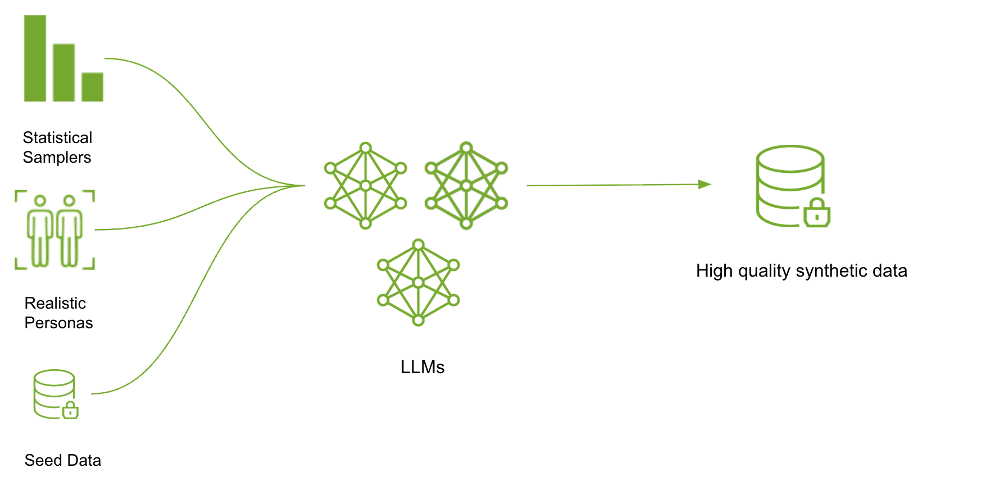

# **Designing Data Designer: Why SDG Is a Systems Problem**

Synthetic data generation is more than a single prompt to a large language model. In this post, we walk through the design principles behind NeMo Data Designer and explain why we built it as a composable orchestration framework \- treating SDG as a system of specialized stages rather than a monolithic generation task.

<!-- more -->



---

When people first encounter synthetic data generation, the instinct is natural: write a detailed prompt, call a powerful LLM, and collect the output. For quick experiments and small datasets, this works fine. But as you push toward production-quality data at scale \- millions of records, multiple interrelated fields, strict quality requirements \- the cracks start to show. We built Data Designer around the conviction that SDG is fundamentally a *systems* problem, and the framework's architecture reflects that belief at every level.

This post isn't about a specific dataset or benchmark result. Instead, we want to pull back the curtain on the design principles that shaped Data Designer itself, and share the reasoning behind the decisions we made.

---

## **A Prompt Is Not All You Need**

The most common approach to synthetic data generation looks something like this: pack everything you need into one prompt \- the schema, the constraints, the style guidelines, the quality criteria \- and send it to the biggest model you have access to. Crank up `max_tokens`, parse the output, and repeat.

This approach has a ceiling, and you hit it faster than you'd expect.

**Quality degrades when you overload a single call.** Asking one model to simultaneously generate content, maintain diversity across a dataset, follow a complex schema, and self-assess quality is asking it to solve several distinct problems at once. The model has to allocate its "attention budget" across all of these competing objectives, and something always gives. Usually it's the subtler requirements \- diversity narrows, edge cases get dropped, and the data starts looking suspiciously uniform.

**Prompts become unmaintainable.** As requirements grow, the prompt balloons. What started as a clean paragraph becomes a multi-page document with nested instructions, conditional logic described in natural language, and examples that compete for context window space. At this point, iterating on one aspect of generation (say, adjusting the complexity distribution or tweaking the output schema) means editing a fragile mega-prompt and hoping nothing else breaks.

**There are no quality gates.** In a single-call setup, validation happens *after* you've already spent the compute. If 30% of your records are malformed or low-quality, you find out at the end and either filter them out (wasting the tokens) or re-generate (wasting even more). There's no mechanism to catch problems between stages, because there *are* no stages.

**Scaling is limited.** A single model call is a single point of failure. You can parallelize across records, but you can't parallelize across *stages* of generation, and you can't route different parts of the task to models that are better suited for them.

None of these are problems with LLMs themselves \- they're problems with treating SDG as a single-step task. The fix isn't a better model. It's a better architecture.

---

## **SDG as a System of Specialized Stages**

The shift in thinking is straightforward: instead of asking one model to do everything, decompose the generation task into a pipeline of focused stages, each responsible for one well-defined job.

Regardless of what you're generating \- QA pairs for retrieval training, reasoning traces for pretraining, multi-turn conversations for alignment, product reviews for testing, or labeled examples for classification \- a well-decomposed SDG pipeline typically has four kinds of stages:

1. **Seed curation.** Control what goes in. Whether you're sampling from an existing corpus, selecting subsets of your data, or generating realistic persona profiles with demographic and personality attributes, the seed data defines the distribution your synthetic data will cover. This is where you control diversity and domain coverage \- before any LLM is involved \- so that downstream generation stages inherit that diversity naturally through their prompts.

2. **Staged generation.** Each generation step has a focused job. One stage might extract structured metadata from a document. Another might generate content grounded in that metadata. A third might transform or enrich that content further. Because each stage has a narrow scope, its prompt is simple, its output is predictable, and it's easy to iterate on independently.

3. **Dependency management.** Later stages build on earlier outputs. A content generation stage needs access to extracted metadata. A formatting stage needs the generated content. These dependencies form a directed acyclic graph (DAG), and the system needs to resolve that graph automatically \- so you can focus on defining the stages, not orchestrating them.

4. **Quality control.** Validation and scoring aren't afterthoughts \- they're explicit stages in the pipeline. An LLM judge can evaluate the output of a generation stage and a validator can check structural constraints. Because these run as part of the generation pipeline, you can identify quality issues early and make informed decisions about which records to keep before investing in further downstream processing.

This decomposition buys you something that a single prompt never can: the ability to reason about, test, and improve each stage independently.

---

## **Design Principles Behind Data Designer**

With that framing in mind, here are the principles that guided Data Designer's architecture.

### **Declarative over imperative**

When you define a Data Designer workflow, you describe the structure of the dataset you want \- not the execution plan for how to generate it. You declare columns, their types, their prompts or schemas, and the models they should use. The framework handles the rest: resolving dependencies, scheduling execution, managing parallelism, batching requests, and retrying failures.

This is a deliberate choice. We wanted the configuration to read like a description of the desired *output*, not a script full of API calls and error handling. It makes workflows easier to read, easier to share, and easier to modify \- you can swap a model, adjust a prompt, or add a validation stage without rewriting control flow.

### **Columns as composable units**

The core abstraction in Data Designer is the *column*. Each column represents a single field in your dataset, and each column has a well-defined generation strategy: it might be an LLM text generation call, a structured output with a Pydantic schema, an embedding computation, a sampler, a Jinja2 expression that combines other columns, or a quality evaluation from an LLM judge.

Columns reference each other through Jinja2 templates. When one column's prompt includes `{{ document_artifacts }}`, the framework knows that column depends on the `document_artifacts` column and must run after it. These references are automatically extracted to build a dependency graph, and the framework topologically sorts the graph to determine execution order. You don't write orchestration code \- you just write columns, and the DAG emerges from the references between them.

This composability is what makes it possible to go from a simple two-column workflow to a complex multi-stage pipeline without changing the underlying execution model.

### **Multi-model by design**

Not every stage in a pipeline needs the same model. Extracting structured metadata from a document is a different task than generating creative long-form content, which is a different task than scoring quality, which is a different task than computing embeddings.

Data Designer treats multi-model orchestration as a first-class concern. Each column can specify its own model alias, and the framework manages model routing, per-model parallelism limits, and usage tracking independently. In practice, this means you can use a large reasoning model for your hardest generation stage, a smaller and faster model for evaluation and scoring, and a dedicated embedding model for semantic representations \- all within the same workflow, without writing any routing logic yourself.

### **Quality as a first-class stage**

In Data Designer, quality control isn't a post-processing step you bolt on after generation. Validators and LLM-as-judge evaluations are column types, just like generation columns. They participate in the same dependency graph, run in the same execution engine, and their outputs are available to downstream stages.

This means you can define a pipeline where a judge evaluates generated records immediately after they're created, and a downstream expression column flags records below a quality threshold \- all within a single workflow definition. Quality scores are part of the pipeline, not something you remember to compute afterwards.

### **Extensibility via plugins**

No framework can anticipate every use case. Data Designer's plugin system lets you define custom column generators that work alongside the built-in types. A plugin is a Python class that inherits from the base column generator, packages with a configuration schema, and registers itself through a standard entry point. Once installed, it's indistinguishable from a built-in column type \- it participates in dependency resolution, batching, and parallel execution like everything else.

This is how domain-specific functionality gets added without forking the framework. If your use case requires embedding-based deduplication with FAISS indices and cosine similarity thresholds, for instance, you can build it as a plugin and drop it into any pipeline that needs it.

---

## **What This Looks Like in Practice**

These principles apply to any SDG use case. Whether you're generating reasoning traces for pretraining (as in our [RQA dev note](rqa.md)), multi-turn conversations for alignment tuning, labeled examples for text classification, product reviews for testing a recommendation system, or code-repair pairs for training a coding assistant \- the same decomposition applies. You identify the stages, define the columns, declare the dependencies, and let the framework handle execution.

To make one example concrete, consider a pipeline for generating training data for a retrieval model. The goal is to produce high-quality question-answer pairs grounded in a corpus of documents, with quality scoring. We choose this example because it exercises several stages and model types in a single workflow, but the pattern generalizes to any domain.

In a single-prompt approach, you'd try to pack all of this into one call: "Given this document, generate diverse QA pairs of varying complexity and only include high-quality ones." The model would do its best, but you'd have limited control over any individual aspect.

With Data Designer, the same task decomposes into a pipeline of focused stages:

```
      Seed Documents         Seed dataset column ingests documents
            │                 from local files or HuggingFace
            ▼
┌─────────────────────────┐
│  Artifact Extraction    │  LLM extracts key concepts, entities,
│                         │  relationships from each document
└───────────┬─────────────┘
            │
            ▼
┌─────────────────────────┐
│  QA Generation          │  LLM generates questions & answers grounded
│                         │  in the extracted artifacts
└───────────┬─────────────┘
            │
            ▼
┌─────────────────────────┐
│  Quality Evaluation     │  LLM judge scores each QA pair
│                         │  on relevance, accuracy, clarity
└───────────┬─────────────┘
            │
            ▼
      Final Dataset
```

Each box is a column. Each one can use a different model. Each one has a focused prompt or algorithm. And because they're declared as columns with explicit dependencies, the framework handles the execution order, the batching, and the parallelism.

The critical insight \- and the one that applies regardless of your use case \- is that every stage is independently *configurable*, *testable*, and *replaceable*. Want to try a different model for quality evaluation? Swap the model alias on that column. Want to tighten quality thresholds? Adjust the judge column's scoring rubric. Want to add a new stage that generates hard negatives for contrastive learning? Add a column and declare its dependencies. The rest of the pipeline doesn't change.

---

## **Summary**

Synthetic data generation at scale is a systems problem, not just a prompting problem. The design principles behind Data Designer reflect this:

1. **Declarative over imperative** \- describe the dataset you want, not the execution plan
2. **Columns as composable units** \- each stage is self-contained, with dependencies resolved automatically via a DAG
3. **Multi-model by design** \- match the model to the task, with per-column model routing
4. **Quality as a first-class stage** \- validators and judges are part of the pipeline, not afterthoughts
5. **Extensibility via plugins** \- add domain-specific logic without forking the framework

The result is a general-purpose framework where complex, multi-stage generation workflows \- whether you're building retrieval training data, reasoning datasets, conversational corpora, or something we haven't imagined yet \- are expressed as simple column declarations. The hard problems of orchestration, dependency resolution, batching, and error handling are solved once, in the framework, rather than reimplemented in every project.

Key Resources:

1. [NeMo Data Designer on GitHub](https://github.com/NVIDIA-NeMo/DataDesigner)
2. [Data Designer Documentation](https://nvidia-nemo.github.io/DataDesigner/)
3. [RQA Dev Note: Graduate-Level Science Reasoning Data](rqa.md)

---

*Want to learn more about NeMo Data Designer? Check out our [documentation](https://nvidia-nemo.github.io/DataDesigner/) and start building your own synthetic data pipelines today.*
